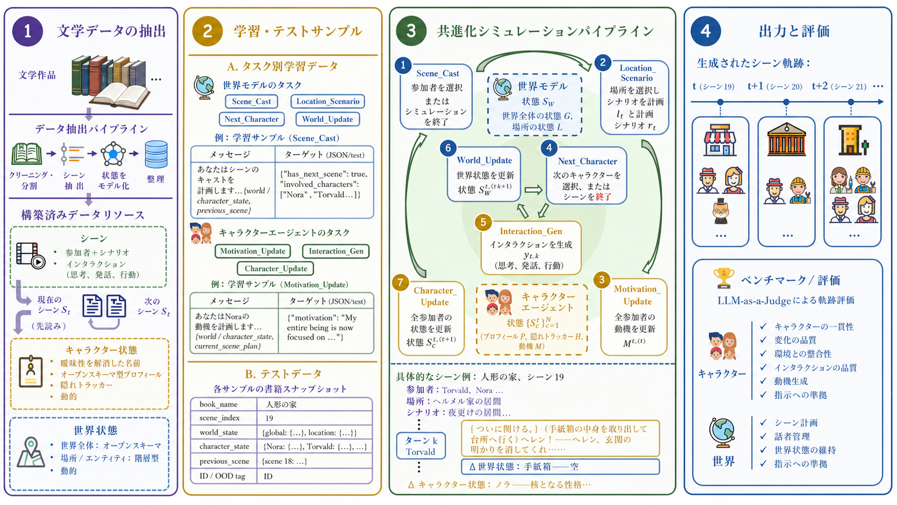

# EvolvingWorld

本リポジトリは、論文 ***「EvolvingWorld: An Open-Schema Framework for Co-Evolving Role-Play Agents and World Model in Interactive Literary World」*** の公式リポジトリです。

論文は[リポジトリ内のPDF](paper/EvolvingWorld.pdf)または[arXiv:2607.17250](https://arxiv.org/abs/2607.17250)で参照できます。

## 🎯 概要



*EvolvingWorldにおけるデータ構築、シミュレーション、評価パイプラインの概要。*

EvolvingWorldは、相互に連携する次の2つのコンポーネントにより、インタラクティブな文学世界をシミュレーションするオープンスキーマ型フレームワークです。

- **世界モデル（World Model）**：シーンの計画、場所と登場人物の選択、次に行動するキャラクターの提案を行い、永続的な世界全体および場所単位の状態を更新します。
- **キャラクターエージェント（Character Agent）**：キャラクターと環境のインタラクションを生成し、キャラクターの状態を更新するとともに、次のシーンに向けた動機を推論します。

主な特長：

- **オープンスキーマ型の状態モデリング**：キャラクタープロフィールと世界全体の設定を、書籍ごとに固有の観点から構築し、シミュレーション中も継続的に変化させます。
- **キャラクターと世界の共進化**：キャラクターの行動によって世界全体または場所単位の状態が変化し、その世界の変化がキャラクターの動機やプロフィールにも影響を与えます。
- **長期シミュレーション**：キャラクターと世界の状態を継続的に変化させながらシーン単位でシミュレーションを進めることで、一貫性のある長期的な軌跡を生成します。
- **複数の時間スケールにわたるキャラクターの変化**：プロフィールを更新する前に、隠れトラッカー（hidden tracker）が弱い兆候や生じつつある兆候を記録します。これにより、短期的な感情の変化から緩やかな性格の変化まで、異なる速度で変化する観点を扱えます。

本リポジトリには、処理済みデータセット、データ構築スクリプト、SFTユーティリティ、シミュレーションパイプライン、および軌跡単位の評価フレームワークが含まれています。

## 📚 目次

- [概要](#概要)
- [リポジトリ構成](#リポジトリ構成)
- [クイックスタート](#クイックスタート)
  - [準備](#1-準備)
  - [シミュレーション](#2-シミュレーション)
  - [評価](#3-評価)
- [学習](#学習)
- [独自データセットの構築](#独自データセットの構築)
  - [元コンテンツの準備](#元コンテンツの準備)
  - [書籍の構造化データの抽出](#書籍の構造化データの抽出)
  - [学習・テストデータへの変換](#学習テストデータへの変換)
- [引用](#引用)

## 🗂️ リポジトリ構成

```text
EvolvingWorld/
├── dataset/              # 公開データセット：抽出済みデータ、SFTデータ、テスト用スナップショット
├── data_construction/    # 抽出済みデータおよび学習・テスト用ファイルの構築パイプライン
├── figure/               # READMEおよび論文用の図
├── paper/                # 論文PDF
├── training/             # LLaMA-FactoryベースのSFTパイプライン
├── simulation/           # 2モデルによるインタラクティブ・シミュレーションパイプライン
└── evaluation/           # LLM-as-a-Judge評価フレームワーク
```

各主要モジュールには、詳しいコマンドを記載したREADMEがあります。

- `data_construction/README.md`
- `training/README.md`
- `simulation/README.md`
- `evaluation/README.md`

## 🚀 クイックスタート

### 🛠️ 1. 準備

**依存パッケージをインストールします。**

データ構築、シミュレーション、評価には、ルートの `pyproject.toml` で管理する共通のuv環境を使用します。LLaMA-Factoryによる学習環境は別に管理します。

データ構築、シミュレーション、評価用：

```bash
uv sync
```

`uv sync` は `.python-version` に従ってPython 3.10と `.venv` を準備し、`uv.lock` に固定された依存パッケージをインストールします。以降のPythonコマンドは `uv run` 経由で実行してください。ローカルvLLMサーバーはGPU環境への依存が大きいため、この共通環境には含めていません。

学習用（現時点ではuv移行の対象外）：

```bash
conda create -n evolvingworld-train python=3.10
conda activate evolvingworld-train
pip install llamafactory accelerate transformers pyyaml datasets matplotlib
```

特に記載がない限り、コマンドはプロジェクトのルートディレクトリ `EvolvingWorld/` で実行してください。

**データセットをダウンロードします。**

処理済みの[EvolvingWorldデータセット](https://huggingface.co/datasets/zongqing0068/EvolvingWorld)はHugging Faceで公開されています。

```bash
uv run hf download zongqing0068/EvolvingWorld \
  --repo-type dataset \
  --local-dir dataset
```

データセットの内容：

- `dataset/extracted_data/scenes/`：要約、シナリオ、インタラクション、キャラクター一覧、場所一覧を含む、標準化されたシーンデータ。
- `dataset/extracted_data/character_dynamic/`：動的なキャラクタープロフィール、動機、短い説明、隠れトラッカー。
- `dataset/extracted_data/world_dynamic/`：動的な世界全体および場所単位の状態。
- `dataset/train/`：世界モデルとキャラクターエージェント向けのShareGPT形式の教師あり学習ファイル。
- `dataset/test/`：評価用のシミュレーション開始時スナップショットと発話スタイルの例。

`dataset/original_books_from_gutenberg.jsonl` は、想定される書籍の生データ入力形式を示すサンプルファイルです。JSONLの各行には、`title`、`author`、`content` フィールドを含める必要があります。

**APIアクセスを設定します。**

OpenAI互換APIを呼び出すスクリプトを使用する場合は、プロジェクトのルートディレクトリに `config.json` を作成してください。

```json
{
  "api_key": "YOUR_API_KEY",
  "base_url": "YOUR_BASE_URL"
}
```

### 🎮 2. シミュレーション

リモートAPIモデルを使用して、テスト用スナップショットを1件実行します。

```bash
uv run python simulation/main.py \
  --input dataset/test/test_all.json \
  --mode remote \
  --world-model gemini-2.5-pro \
  --character-agent-model gemini-2.5-pro \
  --offset 0 --limit 1 \
  --output-dir simulation/outputs/example_run
```

ローカルでのvLLMサービング、より詳しい実行手順、およびパラメーターの説明については、`simulation/README.md` を参照してください。

### 📊 3. 評価

```bash
uv run bash evaluation/run_all_eval.sh --judge gemini-2.5-pro example_run
```

軌跡単位の評価には、2種類のスコア群を導入しています。**CHARACTER**指標は、キャラクターの一貫性、変化の品質、環境との整合性、インタラクションの品質、動機生成、指示への準拠を評価します。**WORLD**指標は、シーン計画、話者管理、世界状態の維持、指示への準拠を評価します。

詳しい評価方法、入出力形式、指標の定義については、`evaluation/README.md` を参照してください。

## 🧠 学習

学習にはLLaMA-Factoryを使用します。世界モデルとキャラクターエージェントは個別に学習します（コード内ではそれぞれ `model_a` と `model_b` として区別されます）。

まず、タスク単位のデータファイルが `dataset/train/` 配下に存在することを確認してから、以下を実行します。

```bash
# 世界モデルを学習（--model model_a）
bash training/run.sh --model model_a --mode full --gpu 0 \
  --model-name-or-path Qwen/Qwen2.5-7B-Instruct

# キャラクターエージェントを学習（--model model_b）
bash training/run.sh --model model_b --mode full --gpu 1 \
  --model-name-or-path Qwen/Qwen2.5-7B-Instruct
```

学習のハイパーパラメーターは `training/train_config.yaml` で設定します。詳しい学習手順については、`training/README.md` を参照してください。

## 📦 独自データセットの構築

独自の書籍やその他のフィクション作品からEvolvingWorld形式のデータセットを構築するには、まず各行が1冊の書籍レコードとなるJSONLファイルを用意します。

```json
{"title": "Pride and Prejudice", "author": "Jane Austen", "content": "..."}
{"title": "The Picture of Dorian Gray", "author": "Oscar Wilde", "content": "..."}
```

構築スクリプトでは、`dataset/original_books_from_gutenberg.jsonl` をデフォルトの入力パスとして使用します。独自のデータセットを構築するには、このファイルを処理したい書籍の原文に置き換えてください。また、同じ形式でEvolvingWorldの構築に使用した原著を収録している [`EvolvingWorld-Books-Gutenberg`](https://huggingface.co/datasets/zongqing0068/EvolvingWorld-Books-Gutenberg) の書籍JSONLを使用することもできます。

続いて、2段階の構築パイプラインを実行します。

```bash
# ステップ1：書籍の構造化データを抽出
uv run python data_construction/main.py \
  --input dataset/original_books_from_gutenberg.jsonl \
  --output_dir data \
  --num_workers 8 \
  --model gemini-2.5-pro \
  --candidate_model claude-sonnet-4-5

# ステップ2：学習・テストデータを構築
uv run python data_construction/transform.py \
  --dir dataset/extracted_data \
  --seed 40
```

パイプラインの詳しい手順とパラメーターの説明については、`data_construction/README.md` を参照してください。

## 📝 引用

EvolvingWorldを利用する場合は、以下を引用してください。

```text
EvolvingWorld: An Open-Schema Framework for Co-Evolving Role-Play Agents and World Model in Interactive Literary World
```
