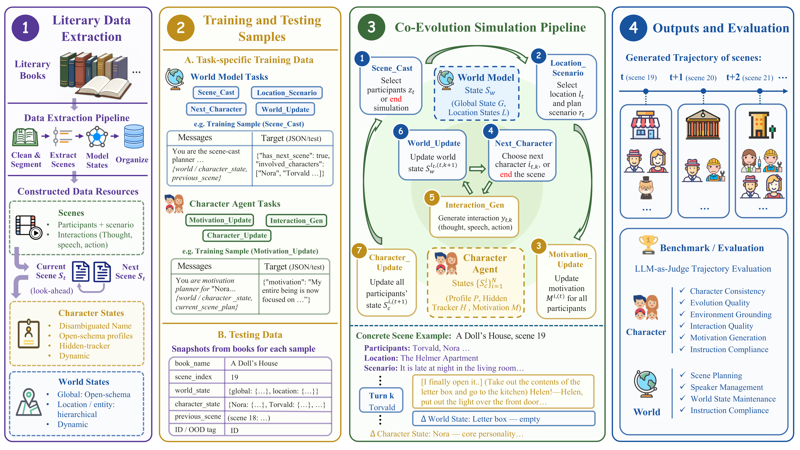

# EvolvingWorld

This is the official repository for the paper ***"EvolvingWorld: An Open-Schema Framework for Co-Evolving Role-Play Agents and World Model in Interactive Literary World"***.

## 🎯 Overview

EvolvingWorld is an open-schema framework for simulating interactive literary worlds with two coupled components:

- **World Model**: plans scenes, selects locations and casts, proposes the next actor, and updates persistent global and location-level world state.
- **Character Agent**: generates character/environment interactions, updates character state, and infers motivations for upcoming scenes.

Key features:

- **Open-schema state modeling**: Character profiles and global world settings are constructed with book-specific dimensions and continue to evolve during simulation.
- **Character-world co-evolution**: Character actions can change global or location-level world states, while world changes can affect character motivations and profiles.
- **Long-horizon simulation**: The simulation rolls forward scene by scene while persistently evolving character and world states, enabling coherent long-horizon trajectories.
- **Multi-timescale character evolution**: Hidden trackers record weak or emerging evidence before profile updates, supporting dimensions that evolve at different speeds, from short-term emotional shifts to slower personality changes.

This repository includes the processed dataset, data construction scripts, SFT utilities, simulation pipeline, and trajectory-level evaluation framework.



*Overview of the EvolvingWorld data construction, simulation, and evaluation pipeline.*

## 📚 Table of Contents

- [Overview](#overview)
- [Repository Structure](#repository-structure)
- [Quick Start](#quick-start)
  - [Preparation](#1-preparation)
  - [Simulation](#2-simulation)
  - [Evaluation](#3-evaluation)
- [Training](#training)
- [Constructing Your Own Dataset](#constructing-your-own-dataset)
  - [Prepare Source Content](#prepare-source-content)
  - [Extract Structured Book Data](#extract-structured-book-data)
  - [Convert to Training and Test Data](#convert-to-training-and-test-data)
- [Citation](#citation)

## 🗂️ Repository Structure

```text
EvolvingWorld/
├── dataset/              # Released dataset: extracted data, SFT data, and test snapshots
├── data_construction/    # Pipeline for constructing extracted data and training/test files
├── figure/               # README and paper figures
├── training/             # LLaMA-Factory based SFT pipeline
├── simulation/           # Two-model interactive simulation pipeline
└── evaluation/           # LLM-as-judge evaluation framework
```

Each major module has its own README with detailed commands:

- `data_construction/README.md`
- `training/README.md`
- `simulation/README.md`
- `evaluation/README.md`

## 🚀 Quick Start

### 🛠️ 1. Preparation

**Install dependencies.**

We recommend using one environment for data construction, simulation, evaluation, and local vLLM serving, and a separate environment for training with LLaMA-Factory.

For data construction, simulation, evaluation, and local vLLM serving:

```bash
conda create -n evolvingworld python=3.10
conda activate evolvingworld
pip install vllm openai jsonlines numpy tiktoken tqdm pyyaml huggingface_hub
```

For training:

```bash
conda create -n evolvingworld-train python=3.10
conda activate evolvingworld-train
pip install llamafactory accelerate transformers pyyaml datasets matplotlib
```

Unless otherwise stated, run commands from the `EvolvingWorld/` project root.

**Download the dataset.**

The processed [EvolvingWorld dataset](https://huggingface.co/datasets/zongqing0068/EvolvingWorld) is hosted on Hugging Face:

```bash
hf download zongqing0068/EvolvingWorld \
  --repo-type dataset \
  --local-dir dataset
```

The dataset contains:

- `dataset/extracted_data/scenes/`: standardized scene data with summaries, scenarios, interactions, character lists, and location lists.
- `dataset/extracted_data/character_dynamic/`: dynamic character profiles, motivations, short descriptions, and hidden trackers.
- `dataset/extracted_data/world_dynamic/`: dynamic global and location-level world states.
- `dataset/train/`: ShareGPT-style supervised training files for the World Model and Character Agent.
- `dataset/test/`: simulation starting snapshots and speaking-style examples for evaluation.

`dataset/original_books_from_gutenberg.jsonl` is an example file that demonstrates the expected raw-book input format. Each JSONL row should contain `title`, `author`, and `content` fields.

**Configure API access.**

For scripts that call an OpenAI-compatible API, create `config.json` in the project root:

```json
{
  "api_key": "YOUR_API_KEY",
  "base_url": "YOUR_BASE_URL"
}
```

### 🎮 2. Simulation

Run one test snapshot with remote API models:

```bash
python simulation/main.py \
  --input dataset/test/test_all.json \
  --mode remote \
  --world-model gemini-2.5-pro \
  --character-agent-model gemini-2.5-pro \
  --offset 0 --limit 1 \
  --output-dir simulation/outputs/example_run
```

For local vLLM serving, more detailed running instructions, and parameter descriptions, see `simulation/README.md`.

### 📊 3. Evaluation

```bash
bash evaluation/run_all_eval.sh --judge gemini-2.5-pro example_run
```

We introduce two score families for trajectory-level evaluation: **CHARACTER** metrics for character consistency, evolution quality, environmental grounding, interaction quality, motivation generation, and instruction compliance; and **WORLD** metrics for scene planning, speaker management, world-state maintenance, and instruction compliance.

See `evaluation/README.md` for detailed evaluation usage, input/output formats, and metric definitions.

## 🧠 Training

Training uses LLaMA-Factory. The World Model and Character Agent are trained separately (distinguished as `model_a` and `model_b` in code).

First ensure the task-level data files exist under `dataset/train/`, then run:

```bash
# Train the World Model (--model model_a)
bash training/run.sh --model model_a --mode full --gpu 0 \
  --model-name-or-path Qwen/Qwen2.5-7B-Instruct

# Train the Character Agent (--model model_b)
bash training/run.sh --model model_b --mode full --gpu 1 \
  --model-name-or-path Qwen/Qwen2.5-7B-Instruct
```

Training hyperparameters are configured in `training/train_config.yaml`. See `training/README.md` for detailed training instructions.

## 📦 Constructing Your Own Dataset

To construct an EvolvingWorld-style dataset from your own books or other fictional works, first prepare a JSONL file where each line is a book record:

```json
{"title": "Pride and Prejudice", "author": "Jane Austen", "content": "..."}
{"title": "The Picture of Dorian Gray", "author": "Oscar Wilde", "content": "..."}
```

`dataset/original_books_from_gutenberg.jsonl` is the default input path used by the construction script. To construct your own dataset, replace this file with the raw text of the books you want to process. Alternatively, you can use the source-book JSONL provided in [`EvolvingWorld-Books-Gutenberg`](https://huggingface.co/datasets/zongqing0068/EvolvingWorld-Books-Gutenberg), which follows the same format and contains the source books used for constructing EvolvingWorld.

Then run the two-stage construction pipeline.

```bash
# Step 1: extract structured book data
python data_construction/main.py \
  --input dataset/original_books_from_gutenberg.jsonl \
  --output_dir data \
  --num_workers 8 \
  --model gemini-2.5-pro \
  --candidate_model claude-sonnet-4-5

# Step 2: build training and test data
python data_construction/transform.py \
  --dir dataset/extracted_data \
  --seed 40
```

See `data_construction/README.md` for detailed pipeline instructions and parameter descriptions.

## 📝 Citation

If you use EvolvingWorld, please cite:

```text
EvolvingWorld: An Open-Schema Framework for Co-Evolving Role-Play Agents and World Model in Interactive Literary World
```

